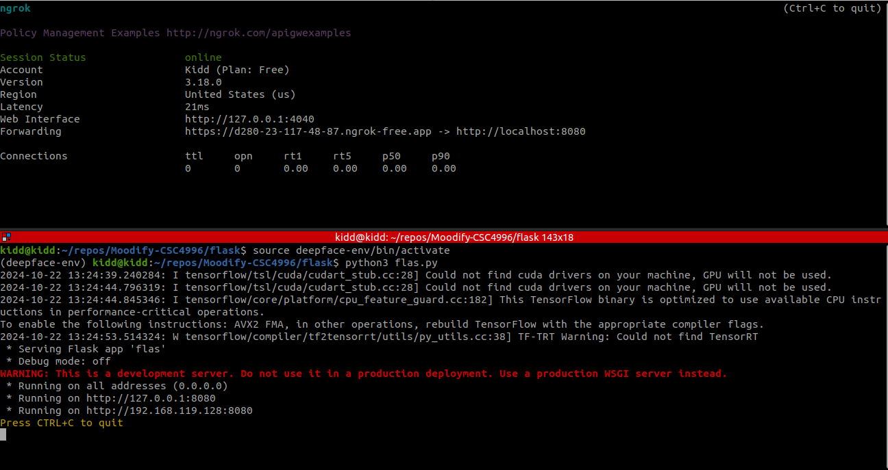

# Moodify-CSC4996

## Downloading Ngrok
Goto the website: https://ngrok.com/ And create an account

Once you create an account, grab your auth token here and add the authtoken


Finally, goto this download page to download ngrok: https://ngrok.com/download

## Setting up flask code
The flask code is located in the Flask folder. 

Filename: flas.py

```py
if __name__ == '__main__':
    app.run(host='0.0.0.0', port=8080)
```
Note: if you change the port, make sure to change it here too

## Running emotion detector server side
Run these commands in the terminal to setup emotion detection on the server side

### Setup ngrok
you can use any port, but in this case 8080 is used
```terminal
ngrok http 8080
```
It should look like this

Everytime you run ngrok again, you have to grab the new url and put it in the homePageView.swift

For example in the example of the picture above: is the new url to be used

https://58db-23-117-48-87.ngrok.free.app

### Updating homePageView

Then you also have to update this line in homePageView.swift

```swift
struct homePageView: View {
    ...
    let backendURL = "https://a46d-2601-406-4d00-7af0-d964-735f-448-6a6a.ngrok-free.app/analyze"
    ...
```

Ensure you add /analyze to the end of the link, exactly as shown above

### Setup virtual env
#### Run this command in the flask folder to build the virtual env
```terminal
python3 -m venv deepface-env
```

#### Run this command in the flask folder to activate the virtual env
```terminal
source deepface-env/bin/activate
```
It should look like this


### Run flask code
```terminal
python3 flas.py
```
#### Note: you may need to install dependencies in order to run the flask code, such as
```terminal
pip install deepface
```

## After following all the steps, your terminal should look like this
Top terminal = ngrok http 8080
Bottom terminal = python3 flas.py


And finally, you can send pictures to flas.py to process for emotion detection 